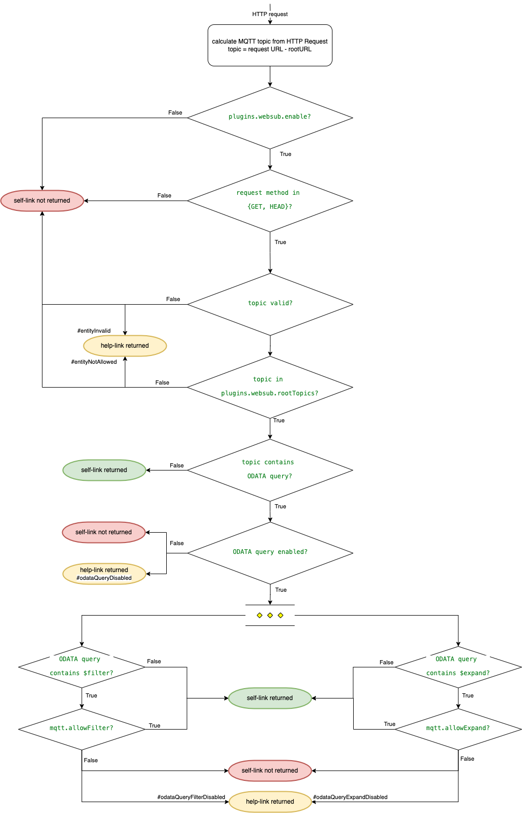

# FROST-Server-WebSub
This implementation is a plugin for the FROST-Server to support a SensorThings API WebSub Hub discovery. This plugin is therefore compliant with [W3C WebSub, §4. Discovery](https://www.w3.org/TR/websub/#discovery).

In a nutshell, compliance means that this plugin determines 
* when to return `Link` headers with `rel="hub"` and `rel="self"`
* what the value for the `rel="self"` link shall be

The overall logic of the WebSub plugin is illustrated in the figure below.



If the plugin is disabled, no `Link` header is exposed. The same is true for any HTTP request methods but `HEAD` and `GET`.
If the plugin is enabled, the `Link rel="hub"` header is always returned.

For further processing, the plugin uses the `rootTopic` configuration. A `rootTopic` is the name of the EntitySet that follows the version information in the URL.
For example, `http://localhost:8080/FROST-Server/v1.1/Things` results in the `rootTopic=Things`. No `Link` header is exposed if the `rootTopic` from the request is not in the set of allowed root topics (see configuration below).

Further processing depends on the value of the HTTP URL query segment. If `request.getUrlQuery()` is empty, the `Link rel="self"` returned is identical to the request URL.

If the request URL contains a query part, i.e, `http://localhost:8080/FROST-Server/v1.1/Observations?$select=result`, the plugin determines the ODATA segment as `request.getUrlQuery()`.
Next, the plugin checks if `$filter` and `$expand` are included in the ODATA segment:
* `Link rel="self"` is not returned, if the ODATA command `$filter` is present AND `mqtt.allowFilter=false`
* `Link rel="self"` is not returned, if the ODATA command `$expand` is present AND `mqtt.allowExpand=false`

The WebSub plugin does not adapt the `Link rel="self"`. Either the `Link rel="self"` contains the original request URL or the `Link rel="self"` header is not returned.

W3C WebSub does not specify how a discovery error is returned. To notify a user (or a client program) why the `Link rel="self"` header is not returned, this plugin returns a link to the error description as a `Link` header.
The plugin returns a `Link` header in the following format `<URL to error>#<error no.>; rel="http://ogc.org/websub/1.0/error"`.
The value for the `rel` is defined in the OGC SensorThings API WebSub Extension.
The `<URL to error>` points to the error page for the WebSub plugin and the `anchor` value points to the section of the error page, applicable to the error.

## Deployment for FROST-Server
The deployment of the WebSub plugin can be integrated into a working deployment of the FROST-Server. You can follow the [FROST-Server documentation](https://fraunhoferiosb.github.io/FROST-Server/) to run your instance.

### Build and deploy WebSub standalone
Clone this directory via `git clone https://github.com/securedimensions/FROST-Server-WebSub.git`. Then `cd FROST-Server-WebSub` and `mvn install`. To run the tests at the end of the `mvn install` you need to have Docker running.

Make sure you copy the `FROST-Server-${project.parent.version}.Plugin.WebSub-${project.version}` file to the appropriate FROST-Server directory and apply the WebSub specific settings below. Then restart FROST-Server.

## Deployment with FROST-Server
Use `git clone -b v2.4.x https://github.com/FraunhoferIOSB/FROST-Server.git FROST-Server.v2.4.x` to create the FROST-Server directory structure.

Then cd `FROST-Server/Plugins` and `git clone https://github.com/securedimensions/FROST-Server-WebSub.git WebSub`.

Add the `WebSub` plugin to the `FROST-Server/Plugins/pom.xml`.

```xml
<modules>
        <module>Actuation</module>
        <module>BatchProcessing</module>
        <module>CoreModel</module>
        <module>FormatCsv</module>
        <module>FormatDataArray</module>
        <module>FormatGeoJson</module>
        <module>ModelLoader</module>
        <module>MultiDatastream</module>
        <module>OData</module>
        <module>OpenApi</module>
        <module>WebSub</module>
    </modules>
```

Then follow the [FROST-Server documentation](https://fraunhoferiosb.github.io/FROST-Server/deployment/architecture-packages.html) applicable to your deployment strategy.


## Configuration
Different features of the WebSub plugin can be activated / deactivated or configured using FROST-Server alike configuration variables:

### Enable the Plugin

As described in the [FROST-Server Plugin documentation](https://fraunhoferiosb.github.io/FROST-Server/settings/plugins.html), you need to add the plugin to the list of plugins to be loaded.

* **plugins.plugins:**
  A comma-separated list of class names, listing additional plugins to load.

  Add the class `de.securedimensions.frostserver.plugin.websub.PluginWebSub` to have the plugin loaded
* **plugins.websub.enable:**  
  Set to `true` to activate the WebSub plugin. Default: `false`.


### Configure Behavior

* **plugins.websub.rootTopics:**  
  A comma separated list of allowed entitysets that can be subscribed to. E.g. "Datastreams,Sensors" would support discovery via the Link rel="self" header for 
  requests that start with `.../Datastreams` or `.../Sensors`. A request to `.../Observations` would not return a self-link.
* **plugins.websub.enable.odataQuery:**
  Set to `true` supports the discovery for topics that include an ODATA query. Default: `false`.
* **mqtt.allowFilter:**
  This is a FROST-Server configuration directive. Set to `true` enables an MQTT to include the ODATA command `$filter`. Default: `true`.
* **mqtt.allowExpand:**
  This is a FROST-Server configuration directive. Set to `true` enables an MQTT to include the ODATA command `$expand`. Default: `true`.
* **plugins.websub.hubUrl:**
  This is the URL to the WebSub Hub that functions as the Publisher.
* **plugins.websub.errorUrl:**
  This URL resolves to the error page.
* **plugins.websub.errorRel:**
  This is the definition for the error relationship as defined in the SensorThings API WebSub Extension standard.

Because a SensorThings API service returns data in the JSON format only, this plugin returns the `Link` information as HTTP response headers.
To enable CORS such that a Javascript based Web-App can access the `Link` headers requires that the `Link` header is listed in the `access-control-expose-headers` response header.

* **http.cors.exposed_headers=Location,Link**: **Note:** It is important to also add `Location` as that is the default.

## Testing
**Note:** Tests are only executed for the SensorThings V1.1. There are no different tests needed for V1.0.

The test cases need reflection the different WebSub plugin configuration options:

* `plugins.websub.rootTopics`: configures the allowed root Entities. E.g.
  * for a STA service: `Datastreams`, `Sensors`, `Things`, `Locations`, `HistoricalLocations`, `Observations`, `FeaturesOfInterest`
  * as per the STAplus data model: `Parties`, `Licenses`, `Campaigns`, `ObservationGroups`, `Relations`
  * if MultiDatastream is enabled: `MultiDatastream`
* `plugins.websub.enable.queryTopics`: set to `true` configures whether the MQTT subscription may include the ODATA part - the query of a service request.
* `mqtt.allowFilter`: set to `true` allows that the ODATA query includes `$filter`
* `mqtt.allowExpand`: set to `true` allows that the ODATA query includes `$expand`

Different test cases are defined to test the processing logic for all of these configurations.


### Testing rootTopics
Four different test cases are defined depending on the root topic:

* `STA` = {`Datastreams`, `Sensors`, `Things`, `Locations`, `HistoricalLocations`, `Observations`, `FeaturesOfInterest`} is concerned with the discovery tests for each entity from the STA data model
* `MultiDatatream` = {`MultiDatastream`} is concerned with the discovery tests for `MulitDatastreams`
* `STAplus` = {`Parties`, `Licenses`, `Campaigns`, `ObservationGroups`, `Relations`} is concerned with the discovery tests for each entity from the STAplus data model
* `Other` = {`Foo`, `/`, ``, ` `, `#`} is concerned with the discovery tests for some other entities that are not one of the above

For each request to a valid entityset that is not included in `plugins.websub.rootTopics`, the plugin does not return a `rel="self"` Link header.
Instead, the plugin returns the `rel="http://ogc.org/websub/1.0/error"` header to inform about the error.

For any service request where root entity does not exist, the service returns a HTTP status code 404. Such a response naturally does not contain any WebSub link headers.

| Class                       | plugins.websub.rootTopics | multiDatastream.enable | staplus.enable | Expected Result |
|:----------------------------|:-------------------------:|:----------------------:|:--------------:|:----------------|
| DiscoveryPathTestSTA00      |    `Datastreams`[^10]     |         false          |     false      | [^20]           |
| DiscoveryPathTestSTA01      |    `Datastreams`[^10]     |         false          |      true      | [^20]           |
| DiscoveryPathTestSTA10      |    `Datastreams`[^10]     |          true          |     false      | [^20]           |
| DiscoveryPathTestSTA11      |    `Datastreams`[^10]     |          true          |      true      | [^20]           |
| DiscoveryPathTestMD00       |  `MultiDatastream`[^11]   |         false          |     false      | [^21]           |
| DiscoveryPathTestMD01       |  `MultiDatastream`[^11]   |         false          |      true      | [^21]           |
| DiscoveryPathTestMD10       |  `MultiDatastream`[^11]   |          true          |     false      | [^22]           |
| DiscoveryPathTestMD11       |  `MultiDatastream`[^11]   |          true          |      true      | [^22]           |
| DiscoveryPathTestSTAplus00  |      `Parties`[^12]       |         false          |     false      | [^23]           |
| DiscoveryPathTestSTAplus01  |      `Parties`[^12]       |         false          |      true      | [^24]           |
| DiscoveryPathTestSTAplus10  |      `Parties`[^12]       |          true          |     false      | [^23]           |
| DiscoveryPathTestSTAplus11  |      `Parties`[^12]       |          true          |      true      | [^24]           |

[^10]: any subset from entityset names valid for the STA data model
[^11]: any subset from entityset names valid for the STAplus data model
[^12]: any subset from entityset names valid for the STA MultiDatastream (only `MultiDatastreams`) 

For each test class, the requests are made for all entityset names in {STA, STAplus, MultiDatastream}. Expected results are:

[^20]: Only `topic` equals `Datastreams` returns `Link rel="self"` header
[^21]: Response is HTTP status 404. => No `Link rel="self"` header returned
[^22]: Only `topic` equals `MultiDatastreams` returns `Link rel="self"` header
[^23]: Response is HTTP status 404. => No `Link rel="self"` header returned
[^24]: Only `topic` equals `Party` returns `Link rel="self"` header

For each test class, the requests are made for all entityset names in {Other} return HTTP status 404 and therefore no `Link rel="self"` header may be present.

### Testing enable.queryTopics
Configuring with the WebSub plugin with `enable.odataQuery=true` allows that a self-link contains an ODATA segment.
Returning the correct self-link must take under consideration if the service supports `$filer` or `$expand`.

Each of these test cases have to be tested by starting a new SensorThings service with the following configurations:

| Class                 |              path+query               | mqtt.allowFilter | mqtt.allowExpand | Expected Result |
|:----------------------|:-------------------------------------:|:----------------:|:----------------:|:----------------|
| DiscoveryWithQuery00  | .../Observations?$filter=result gt 30 |      false       |      false       | [^30]           |
| DiscoveryWithQuery00  |  .../Observations?$expand=Datastream  |      false       |      false       | [^31]           |
| DiscoveryWithQuery01  | .../Observations?$filter=result gt 30 |      false       |       true       | [^32]           |
| DiscoveryWithQuery01  |  .../Observations?$expand=Datastream  |      false       |       true       | [^33]           |
| DiscoveryWithQuery10  | .../Observations?$filter=result gt 30 |       true       |      false       | [^34]           |
| DiscoveryWithQuery10  |  .../Observations?$expand=Datastream  |       true       |      false       | [^35]           |
| DiscoveryWithQuery11  | .../Observations?$filter=result gt 30 |       true       |       true       | [^36]           |
| DiscoveryWithQuery11  |  .../Observations?$expand=Datastream  |       true       |       true       | [^37]           |

All test cases must return the `Link rel="hub"` header. In addition, the following Link header is returned:
[^30]: `Link  <plugins.websub.errorUrl#odataQueryFilterDisabled>; rel="<plugins.websub.errorRel>"`
[^31]: `Link  <plugins.websub.errorUrl#odataQueryExpandDisabled>; rel="<plugins.websub.errorRel>"`
[^32]: `Link  <plugins.websub.errorUrl#odataQueryFilterDisabled>; rel="<plugins.websub.errorRel>"`
[^33]: `Link  <...>; rel="self"`
[^34]: `Link  <...>; rel="self"`
[^35]: `Link  <plugins.websub.errorUrl#odataQueryExpandDisabled>; rel="<plugins.websub.errorRel>"`
[^36]: `Link  <plugins.websub.errorUrl#odataQueryFilterDisabled>; rel="<plugins.websub.errorRel>"`
[^37]: `Link  <...>; rel="self"`
[^38]: `Link  <...>; rel="self"`

