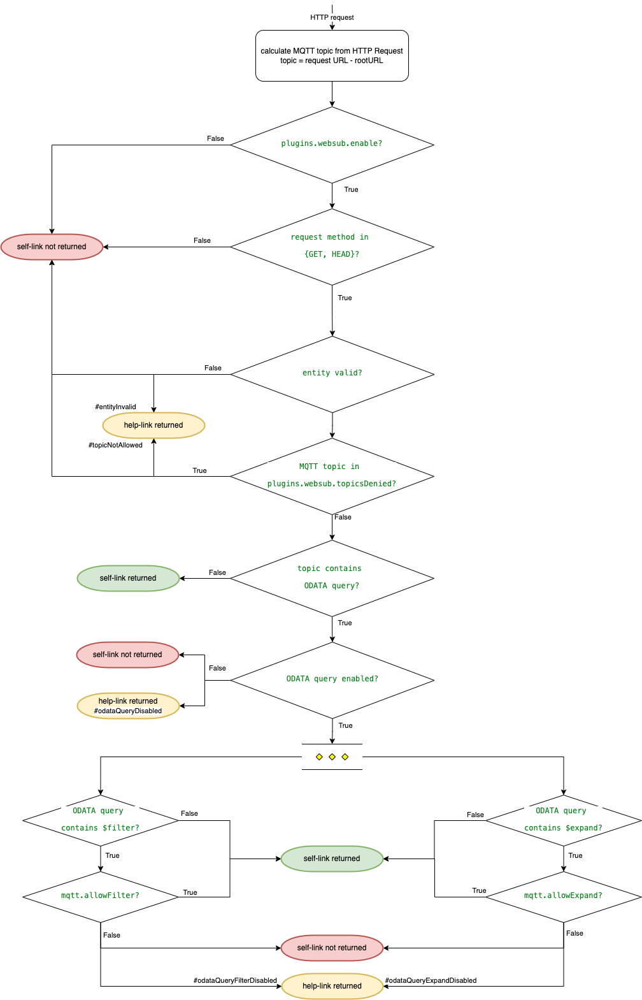

# FROST-Server-WebSub
This implementation is a plugin for the FROST-Server to support a SensorThings API WebSub Hub discovery. 
This plugin is therefore compliant with [W3C WebSub, §4. Discovery](https://www.w3.org/TR/websub/#discovery).

In a nutshell, compliance means that this plugin determines 
* when to return `Link` headers with `rel="hub"` and `rel="self"`
* what the value for the `rel="self"` link shall be

In addition, this plugin returns a `Link` header with `rel="help"` if no `rel="self"` Link header can be returned.
This is done to support the user understanding, why no self-link was returned.

The overall logic of the WebSub plugin is illustrated in the figure below.



If the plugin is disabled, no WebSub `Link` header is exposed. The same is true for any HTTP request methods but `HEAD` and `GET`.
If the plugin is enabled, the `Link rel="hub"` header is always returned.

For further processing, the plugin uses the `topics_denied` configuration. The array `topics_denied` contains all MQTT topics that cannot be used for subscription. 
For example, `topics_denied=["v1.1/Things","v1.1/Observations"]` suppress that the discovery headers `Link rel="self"` is returned for URLs 
like `http://localhost:8080/FROST-Server/v1.1/Things` or `http://localhost:8080/FROST-Server/v1.1/Observations` assuming that `http://localhost:8080/FROST-Server/v1.1` is the baseURL of the service.

Further processing depends on the value of the HTTP URL query segment. If `request.getUrlQuery()` is empty, the `Link rel="self"` returned is identical to the request URL.

If the request URL contains a query part, i.e, `http://localhost:8080/FROST-Server/v1.1/Observations?$select=result`, the plugin determines the ODATA segment as `request.getUrlQuery()`.
Next, the plugin checks if `$filter` and `$expand` are included in the ODATA segment:
* `Link rel="self"` is not returned, if the ODATA command `$filter` is present AND `mqtt.allowFilter=false`
* `Link rel="self"` is not returned, if the ODATA command `$expand` is present AND `mqtt.allowExpand=false`

The WebSub plugin does not adapt the `Link rel="self"`. Either the `Link rel="self"` contains the original request URL or the `Link rel="self"` header is not returned.

W3C WebSub does not specify how a discovery additional information why no `Link rel="self"` is returned. 
To inform a user (or a client program) why the `Link rel="self"` header is not returned, this plugin returns a 
`Link` with `rel="help"` plus a URL to the help description as a `Link` header.
The plugin returns a `Link` header in the following format `<URL to error>#<identifier>; rel="help"`.
The `<URL to the help>` points to the help page for the WebSub plugin and the `#identifier` value points to the applicable section of the help page.

## Deployment for FROST-Server
The deployment of the WebSub plugin can be integrated into [version 2.8.x of FROST-Server](https://github.com/FraunhoferIOSB/FROST-Server/tree/v2.8.x). 
You can follow the [FROST-Server documentation](https://fraunhoferiosb.github.io/FROST-Server/) to run your instance.

### Build and deploy WebSub standalone
Clone this directory via `git clone -b v1.0.0-FROST-Server.v2.8.x https://github.com/securedimensions/FROST-Server-WebSub.git`. Then `cd FROST-Server-WebSub` and `mvn install`. 
To run the tests at the end of the `mvn install` you need to have Docker running.

Make sure you copy the `FROST-Server-${project.parent.version}.Plugin.WebSub-${project.version}.jar` file to the appropriate FROST-Server directory and apply the WebSub specific settings below. Then restart FROST-Server.

## Deployment with FROST-Server
Use `git clone -b v2.8.x https://github.com/FraunhoferIOSB/FROST-Server.git FROST-Server.v2.8.x` to create the FROST-Server directory structure.

Then cd `FROST-Server.v2.8.x/Plugins` and `git clone -b v1.0.0-FROST-Server.v2.8.x https://github.com/securedimensions/FROST-Server-WebSub.git WebSub`.

Add the `WebSub` plugin to the `FROST-Server/Plugins/pom.xml`.

```xml
<modules>
        <module>Actuation</module>
        <module>BatchProcessing</module>
        <module>CoreModel</module>
        <module>FormatCsv</module>
        <module>FormatDataArray</module>
        <module>FormatGeoJson</module>
        <module>ModelLoader</module>
        <module>MultiDatastream</module>
        <module>OData</module>
        <module>OpenApi</module>
        <module>WebSub</module>
    </modules>
```

Then follow the [FROST-Server documentation](https://fraunhoferiosb.github.io/FROST-Server/deployment/architecture-packages.html) applicable to your deployment strategy.


## Configuration
Different features of the WebSub plugin can be activated / deactivated or configured using FROST-Server alike configuration variables:

### Enable the Plugin

As described in the [FROST-Server Plugin documentation](https://fraunhoferiosb.github.io/FROST-Server/settings/plugins.html), you need to add the plugin to the list of plugins to be loaded.

* **plugins.plugins:**
  A comma-separated list of class names, listing additional plugins to load.

  Add the class `de.securedimensions.frostserver.plugin.stawebsub.PluginWebSub` to have the plugin loaded
* **plugins.stawebsub.enable:**  
  Set to `true` to activate the WebSub plugin. Default: `false`.


### Configure Behavior

* **plugins.stawebsub.topicsDenied:**  
  A comma separated list of MQTT topics that **can not** be used for subscription. E.g. `"v1.1/Datastreams(4711),v1.1/Observations"` would cause that no Link rel="self" header is returned for 
  requests that start with `http://localhost:8080/FROST-Server/v1.1/Datastreams(4711)` or `http://localhost:8080/FROST-Server/v1.1/Sensors` (assuming that `http://localhost:8080/FROST-Server/v1.1` is the service base URL). 
  A request to `http://localhost:8080/FROST-Server/v1.1/Observations` would return the self-link `link: <http://localhost:8080/FROST-Server/v1.1/Observations>; rel="self"`.
* **plugins.stawebsub.enable.odataQuery:**
  Set to `true` supports the discovery for topics that include an ODATA query. Default: `false`.
* **mqtt.allowFilter:**
  This is a FROST-Server configuration directive. Set to `true` enables an MQTT to include the ODATA command `$filter`. Default: `true`.
* **mqtt.allowExpand:**
  This is a FROST-Server configuration directive. Set to `true` enables an MQTT to include the ODATA command `$expand`. Default: `true`.
* **plugins.stawebsub.hubUrl:**
  This is the URL to the WebSub Hub that functions as the Publisher.
* **plugins.stawebsub.helpUrl:**
  This URL resolves to the help page.

Because a SensorThings API service returns data in the JSON format only, this plugin returns the `Link` information as HTTP response headers.
To enable CORS such that a Javascript based Web-App can access the `Link` headers requires that the `Link` header is listed in the `access-control-expose-headers` response header.

* **http.cors.exposed_headers=Location,Link**: **Note:** It is important to also add `Location` as that is the default.

According to the W3C WebSub Recommendation, section §4 Discovery, the plugin must return the Link headers for HTTP `GET` and `HEAD` methods.
In order to allow the discovery via HTTP HEAD from a Javascript-based Web-App, the FROST-Server CORS configuration must include
the literal `HEAD` in the `http.cors.allowed.methods` configuration setting.

* **http.cors.allowed.methods=HEAD,...:** **Note:** It is important to add the otherwise default methods in this list.

## Testing
**Note:** Tests are only executed for the SensorThings V1.1. There are no different tests needed for V1.0.

The test cases need reflection the different WebSub plugin configuration options:

* `plugins.stawebsub.topicsDenied`: configures the not allowed MQTT topics
  * E.g. for a STA service: `v1.1/Datastreams`, `v1.1/Datastreams(123)`, `v1.1/Things`
  * E.g. as per the STAplus data model: `v1.1/Parties`
  * E.g. if MultiDatastream is enabled: `v1.1/MultiDatastreams`
* `plugins.stawebsub.enable.odataQuery`: set to `true` configures whether the MQTT subscription may include the ODATA part - the query of a service request.
* `mqtt.allowFilter`: set to `true` allows that the ODATA query includes `$filter`
* `mqtt.allowExpand`: set to `true` allows that the ODATA query includes `$expand`

Different test cases are defined to test the processing logic for all of these configurations.


### Testing rootTopics
Four different test cases are defined depending on the root topic:

* `STA` = {`Datastreams`, `Sensors`, `Things`, `Locations`, `HistoricalLocations`, `Observations`, `FeaturesOfInterest`} is concerned with the discovery tests for each entity from the STA data model
* `MultiDatatream` = {`MultiDatastream`} is concerned with the discovery tests for `MulitDatastreams`
* `Other` = {`Foo`, `/`, ``, ` `, `#`} is concerned with the discovery tests for some other entities that are not one of the above

For each request to a valid entityset which corresponding MQTT topic is not included in `plugins.stawebsub.topicsDenied`, the plugin does return a `rel="self"` Link header.
For any other request, the plugin returns the `rel="help"` header to inform about the reason for the missing self-link.

For any service request where root entity does not exist, the service returns a HTTP status code 404. Such a response naturally does not contain any WebSub link headers.

| Class                      | entity                    | plugins.stawebsub.topicsDenied | multiDatastream.enable | Expected Result |
|:---------------------------|:-------------------------:|:--------------------------:|::-----------------------|
| DiscoveryPathTestSTA0      |    `Datastreams`[^10]     | `v1.1/Datastreams`         |         false           |[^11]            |
| DiscoveryPathTestSTA1      |    `Datastreams`[^10]     | ``                         |          true           |[^11]            |
| DiscoveryPathTestMD0       |  `MultiDatastream`[^20]   | ``                         |         false           |[^21]            |
| DiscoveryPathTestMD1       |  `MultiDatastream`[^20]   | ``                         |          true           |[^22]            |

[^10]: any subset from entityset names valid for the STA data model
[^20]: any subset from entityset names valid for the STA MultiDatastream (only `MultiDatastreams`) 

For each test class, the requests are made for all entityset names in {STA, MultiDatastream}. Expected results are:

[^11]: Only `topic` equals `Datastreams` returns `Link rel="self"` header
[^21]: Response is HTTP status 404. => No `Link rel="self"` header returned
[^22]: Only `topic` equals `MultiDatastreams` returns `Link rel="self"` header

For each test class, the requests are made for all entityset names in {Other} return HTTP status 404 and therefore no `Link rel="self"` header may be present.

### Testing enable.queryTopics
Configuring with the WebSub plugin with `enable.odataQuery=true` allows that a self-link contains an ODATA segment.
Returning the correct self-link must take under consideration if the service supports `$filer` or `$expand`.

Each of these test cases have to be tested by starting a new SensorThings service with the following configurations:

| Class                 |              path+query               | mqtt.allowFilter | mqtt.allowExpand | Expected Result |
|:----------------------|:-------------------------------------:|:----------------:|:----------------:|:----------------|
| DiscoveryWithQuery00  | .../Observations?$filter=result gt 30 |      false       |      false       | [^30]           |
| DiscoveryWithQuery00  |  .../Observations?$expand=Datastream  |      false       |      false       | [^31]           |
| DiscoveryWithQuery01  | .../Observations?$filter=result gt 30 |      false       |       true       | [^32]           |
| DiscoveryWithQuery01  |  .../Observations?$expand=Datastream  |      false       |       true       | [^33]           |
| DiscoveryWithQuery10  | .../Observations?$filter=result gt 30 |       true       |      false       | [^34]           |
| DiscoveryWithQuery10  |  .../Observations?$expand=Datastream  |       true       |      false       | [^35]           |
| DiscoveryWithQuery11  | .../Observations?$filter=result gt 30 |       true       |       true       | [^36]           |
| DiscoveryWithQuery11  |  .../Observations?$expand=Datastream  |       true       |       true       | [^37]           |

All test cases must return the `Link rel="hub"` header. In addition, the following Link header is returned:
[^30]: `Link  <plugins.stawebsub.helpUrl#odataQueryFilterDisabled>; rel="help"`
[^31]: `Link  <plugins.stawebsub.helpUrl#odataQueryExpandDisabled>; rel="help"`
[^32]: `Link  <plugins.stawebsub.helpUrl#odataQueryFilterDisabled>; rel="help"`
[^33]: `Link  <...>; rel="self"`
[^34]: `Link  <...>; rel="self"`
[^35]: `Link  <plugins.stawebsub.helpUrl#odataQueryExpandDisabled>; rel="help"`
[^36]: `Link  <plugins.stawebsub.helpUrl#odataQueryFilterDisabled>; rel="help"`
[^37]: `Link  <...>; rel="self"`
[^38]: `Link  <...>; rel="self"`

### TestSuite execution results

The `OGC STA-WebSub Extension — Conformance Class Discovery` executable Test Suite produced the following output:

#### T1 [req-landing-page-discovery] Landing page returns STA v1.1 root page with conf URI<br>
✔ GET root page returns HTTP 200 with STA v1.1 compliant body (4.066989ms)<br>
✔ Root page conformance array includes the STA-WebSub discovery URI (2.438187ms)<br>
✔ T1 [req-landing-page-discovery] Landing page returns STA v1.1 root page with conf URI (7.184655ms)<br>
#### T2 [req-landing-page-topics] Root page advertises topics_denied<br>
✔ GET root page returns 2xx (3.654797ms)<br>
✔ serverSettings[CONF_URI] exists and contains topics_denied JSON array (2.641671ms)<br>
✔ Each topics_denied value follows the SERVICE_VERSION/RESOURCE_PATH pattern (2.8.x769ms)<br>
✔ T2 [req-landing-page-topics] Root page advertises topics_denied (9.475001ms)<br>
#### T3 [req-landing-page-odata] Root page advertises odata_denied<br>
✔ GET root page returns 2xx (2.507618ms)<br>
✔ serverSettings[CONF_URI] exists and contains odata_denied JSON array (2.667889ms)<br>
✔ T3 [req-landing-page-odata] Root page advertises odata_denied (5.478474ms)<br>
#### T4 [req-http-methods] HTTP GET is accepted and returns hub link header<br>
✔ GET topic URL returns 2xx and includes Link rel="hub" (5.789713ms)<br>
✔ T4 [req-http-methods] HTTP GET is accepted and returns hub link header (6.079183ms)<br>
#### T5 [req-http-methods] HTTP HEAD is accepted and returns hub link header<br>
✔ HEAD topic URL returns 2xx and includes Link rel="hub" (5.014729ms)<br>
✔ T5 [req-http-methods] HTTP HEAD is accepted and returns hub link header (5.198658ms)<br>
#### T6 [req-link-hub] Both HEAD and GET return Link rel="hub" for any topic URL<br>
✔ HEAD topic URL includes Link rel="hub" (2.887432ms)<br>
✔ GET topic URL includes Link rel="hub" (6.306817ms)<br>
✔ T6 [req-link-hub] Both HEAD and GET return Link rel="hub" for any topic URL (9.424366ms)<br>
#### T7 [req-link-self] Allowed topic URLs return Link rel="hub" and rel="self"<br>
✔ §14.2.1, §14.2.2, §14.2.3 allowed URLs return hub and self (HEAD and GET) (37.545346ms)<br>
✔ T7 [req-link-self] Allowed topic URLs return Link rel="hub" and rel="self" (37.695786ms)<br>
#### T8 [req-link-help] Denied topic URLs return hub+help, not self<br>
✔ URL denied via topics_denied returns hub+help, not self (49.132815ms)<br>
✔ URL denied via odata_denied returns hub+help, not self (23.401877ms)<br>
✔ T8 [req-link-help] Denied topic URLs return hub+help, not self (72.773321ms)<br>
#### T9 [req-odata-support] ODATA-extended topic URLs return STA v1.1 compliant responses<br>
﹣ §14.2.1 collection URL + ODATA option returns STA v1.1 compliant response (0.26934ms) # All known ODATA options are denied — cannot construct a valid §14.2.1 + ODATA URL<br>
﹣ §14.2.2 entity URL + ODATA option returns STA v1.1 compliant response (0.133859ms) # No allowed non-$expand ODATA options available for entity URL test<br>
✔ T9 [req-odata-support] ODATA-extended topic URLs return STA v1.1 compliant responses (0.549422ms)<br>
#### T10 [req-odata-discovery] Root page advertises STA-WebSub support via conf URI and odata_denied<br>
✔ HEAD root page returns 2xx (5.322072ms)<br>
✔ Root page conformance section includes conf URI (4.464519ms)<br>
✔ serverSettings[CONF_URI] contains odata_denied as a JSON array (3.33771ms)<br>
✔ T10 [req-odata-discovery] Root page advertises STA-WebSub support via conf URI and odata_denied (13.426442ms)<br>
#### T11 [req-odata-blacklisting] URLs with denied ODATA options return hub+help, not self<br>
✔ Each odata_denied option yields hub+help and no self (HEAD and GET) (75.136325ms)<br>
✔ T11 [req-odata-blacklisting] URLs with denied ODATA options return hub+help, not self (75.440715ms)<br>
#### T12 [req-odata-blacklisting] URLs with allowed ODATA options return self (HEAD and GET)<br>
﹣ Allowed ODATA options yield Link rel="self" that includes the request URL (0.355025ms) # All known ODATA options are denied — no allowed options to test<br>
✔ T12 [req-odata-blacklisting] URLs with allowed ODATA options return self (HEAD and GET) (0.51844ms)<br>
#### T13 [req-topics-discovery] Root page advertises STA-WebSub support via conf URI and topics_denied<br>
✔ HEAD root page returns 2xx (4.262281ms)<br>
✔ Root page conformance section includes conf URI (2.879737ms)<br>
✔ serverSettings[CONF_URI] contains topics_denied as a JSON array (2.556688ms)<br>
✔ Each topics_denied value follows SERVICE_VERSION/RESOURCE_PATH pattern (2.944775ms)<br>
✔ T13 [req-topics-discovery] Root page advertises STA-WebSub support via conf URI and topics_denied (12.949687ms)<br>
#### T14 [req-topics-blacklisting] Denied topic URLs return hub+help, not self<br>
✔ URL constructed from topics_denied returns hub+help and no self (HEAD and GET) (6.938202ms)<br>
✔ T14 [req-topics-blacklisting] Denied topic URLs return hub+help, not self (7.051132ms)<br>
#### T15 [req-topics-blacklisting] Allowed topic URLs return self, not help<br>
✔ Multiple allowed topic URLs return Link rel="self" and no rel="help" (HEAD and GET) (21.445639ms)<br>
✔ T15 [req-topics-blacklisting] Allowed topic URLs return self, not help (21.571309ms)<br>
✔ OGC STA-WebSub Extension — Conformance Class Discovery (381.766452ms)<br>

#### Result summary
ℹ tests 27<br>
ℹ suites 16<br>
ℹ pass 24<br>
ℹ fail 0<br>
ℹ cancelled 0<br>
ℹ skipped 3<br>
ℹ todo 0<br>
ℹ duration_ms 564.464735<br>
